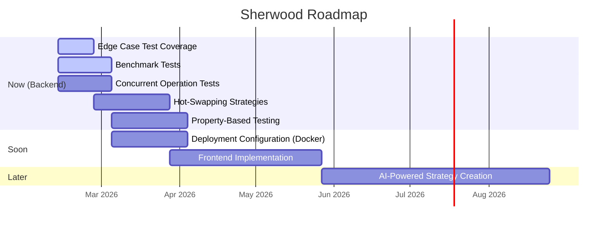

# Roadmap

This document tracks Sherwood's development roadmap. Features are organized into three priority buckets based on complexity and readiness. When a feature is completed, it is moved to [Completed Features](Completed-Features) following the [Maintenance Guidelines](../docs/MAINTENANCE.md).

For early-stage brainstorms not yet on the roadmap, see [Ideas](Ideas).

---

## Overview



| Bucket | Feature | Complexity | Type |
| :----- | :------ | :--------- | :--- |
| 🟢 **Now** | Edge Case Test Coverage | Low-Medium | Backend |
| 🟢 **Now** | Benchmark Tests | Medium | Backend |
| 🟢 **Now** | Concurrent Operation Tests | Medium-High | Backend |
| 🟢 **Now** | Hot-Swapping Strategies | Medium-High | Backend |
| 🟢 **Now** | Property-Based Testing | High | Backend |
| 🟡 **Soon** | Deployment Configuration (Docker) | High | DevOps |
| 🟡 **Soon** | Frontend Implementation | High | Frontend |
| 🔴 **Later** | AI-Powered Strategy Creation | Very High | Backend / AI |

---

## 🟢 Now

Backend features ready to pick up immediately.

### 1. Edge Case Test Coverage

**Complexity:** Low-Medium

**Description:**
Expand test coverage for boundary conditions and edge cases in validation, data handling, and error scenarios.

**Missing Edge Cases:**

1. **Input Validation:**
   - Order with quantity = 0
   - Negative prices
   - Symbol with special characters (Unicode, emojis)
   - Extremely long symbol names (>100 chars)
   - Future dates in historical data requests

2. **Resource Limits:**
   - Backtest with 10+ year date range
   - Order list with 10,000+ orders
   - Concurrent backtest limit testing

3. **Error Recovery:**
   - Database connection loss during operation
   - Broker connection timeout
   - Data provider rate limit hit
   - Disk full during database write

4. **State Management:**
   - Server restart with pending orders
   - Partial fill handling
   - Balance reconciliation after failed trades

**Implementation:**
Add table-driven tests for validation edge cases, integration tests for error recovery scenarios.

---

### 2. Benchmark Tests for Performance Monitoring

**Complexity:** Medium

**Description:**
Add benchmark tests to detect performance regressions in critical paths (backtesting, order placement, data fetching).

**Current State:**
No benchmark tests exist. Manual performance testing only.

**Implementation Requirements:**

1. **Backtest Engine Benchmarks:** Test with various data set sizes (1 month, 1 year, 5 years)
2. **Order Placement Throughput:** Measure orders/second capacity
3. **Data Provider Latency:** Benchmark historical data fetching
4. **API Response Times:** Benchmark common endpoints
5. **CI Integration:** Track benchmark results over time

**Files to Create:**

- `backend/backtesting/engine_bench_test.go`
- `backend/execution/order_manager_bench_test.go`
- `backend/data/providers/yahoo_bench_test.go`
- `backend/api/handlers_bench_test.go`

**Example:**

```go
func BenchmarkBacktest_LargeDataset(b *testing.B) {
    // Generate 1 year of daily data
    data := generateMockData(365)
    strategy := strategies.NewMACrossover()
    
    b.ResetTimer()
    for i := 0; i < b.N; i++ {
        engine.Run(strategy, data, config)
    }
}
```

---

### 3. Concurrent Operation Tests

**Complexity:** Medium-High

**Description:**
Add tests to verify thread safety and race condition protection in concurrent scenarios (multiple simultaneous orders, parallel backtests).

**Current State:**
No explicit concurrent operation tests. Thread safety assumed but not verified.

**Implementation Requirements:**

1. **Concurrent Order Placement:** 10+ goroutines placing orders simultaneously
2. **Parallel Backtests:** Multiple backtests running concurrently
3. **Strategy Hot-Swap During Trading:** Enable/disable strategies while engine running
4. **Data Provider Concurrent Requests:** Multiple threads fetching data
5. **Race Detector:** Run tests with `-race` flag in CI

**Test Strategy:**

```go
func TestConcurrentOrderPlacement(t *testing.T) {
    var wg sync.WaitGroup
    orderManager := setupOrderManager()
    
    // Launch 10 goroutines placing orders
    for i := 0; i < 10; i++ {
        wg.Add(1)
        go func(id int) {
            defer wg.Done()
            order, err := orderManager.CreateMarketOrder(
                "AAPL", models.OrderSideBuy, 10)
            assert.NoError(t, err)
        }(i)
    }
    
    wg.Wait()
    // Verify all orders processed correctly
}
```

---

### 4. Hot-Swapping Strategies

**Complexity:** Medium-High

**Description:**
Enable/disable trading strategies at runtime without restarting the application.

**Current Limitation:**
Strategies are loaded once at startup from `ENABLED_STRATEGIES` environment variable.

**Implementation Requirements:**

1. **API Endpoints:** `POST /api/v1/strategies/{name}/enable` and `/disable`
2. **Thread-Safe Registry:** Add Enable/Disable methods with mutex protection
3. **Engine Coordination:** Check if strategy enabled before processing
4. **Position Management:** Decide what happens to positions when strategy disabled
5. **State Persistence:** Store enabled/disabled state in database
6. **Frontend Integration:** Toggle switches in strategy list UI

**Edge Cases:**

- Disabling strategy during trade execution
- Multiple concurrent enable/disable requests
- Restart behavior with partially enabled strategies

---

### 5. Property-Based Testing

**Complexity:** High

**Description:**
Implement property-based testing for complex logic using testing frameworks like `gopter` to generate random test cases and verify invariants.

**Use Cases:**

1. **Backtest Engine:** Verify account balance never goes negative, equity curve properties
2. **Order Manager:** Verify order state transitions valid, balance always matches positions
3. **Risk Manager:** Verify limits always enforced regardless of input
4. **Technical Indicators:** Verify mathematical properties (SMA always within data range, etc.)

**Example:**

```go
import "github.com/leanovate/gopter"

func TestBacktest_BalanceNeverNegative(t *testing.T) {
    properties := gopter.NewProperties(nil)
    
    properties.Property("balance never negative", prop.ForAll(
        func(trades []Trade) bool {
            result := runBacktest(trades)
            return result.FinalBalance >= 0
        },
        genTrades(),
    ))
    
    properties.TestingRun(t)
}
```

---

## 🟡 Soon

Features to tackle once the backend is solid.

### 6. Deployment Configuration (Docker)

**Complexity:** High

**Description:**
Create Dockerfiles and docker-compose configuration to containerize the application.

**Implementation Requirements:**

1. **Backend Dockerfile:** Multi-stage build (golang builder + alpine runtime)
2. **Frontend Dockerfile:** Build React app with Vite, serve with nginx
3. **docker-compose.yml:** Services for backend, frontend, database with health checks
4. **Deployment Directory:** `deployments/docker/` and `deployments/k8s/` (optional)
5. **Documentation:** Update README with Docker usage instructions

**Files to Create:**

- `backend/Dockerfile`
- `frontend/Dockerfile`
- `docker-compose.yml`
- `docker-compose.dev.yml`
- `.dockerignore`

---

### 7. Frontend Implementation

**Complexity:** High

**Description:**
Build the React-based web dashboard for Sherwood as specified in DESIGN.md.

**Implementation Requirements:**

1. **Scaffolding:** Initialize Vite + React + TypeScript project
2. **Core Pages:** Dashboard, Strategies, Backtesting, Orders, Settings
3. **API Integration:** axios client with react-query for data fetching
4. **State Management:** Redux for global state, React Query for server state
5. **Visualization:** Recharts for equity curves and performance metrics
6. **Responsive Design:** Material-UI components, mobile-friendly, dark mode

**Directory Structure:**

```plaintext
frontend/
├── src/
│   ├── components/
│   ├── pages/
│   ├── services/    # API client
│   ├── hooks/
│   └── store/       # Redux
```

---

## 🔴 Later

High-complexity features requiring significant design and research. Additional items from [Ideas](Ideas) will be promoted here as they are refined.

### 8. AI-Powered Strategy Creation & Adaptation

**Complexity:** Very High

**Description:**
Integrate an AI/ML feature that can create new trading strategies and dynamically update them based on changing market conditions.

**Implementation Requirements:**

1. **LLM-Based Strategy Generation:** Allow users to describe a strategy in natural language and have an LLM generate the corresponding strategy code
2. **Reinforcement Learning for Parameter Tuning:** Automatically optimize strategy parameters using RL agents
3. **Sentiment Analysis:** Integrate news and social media sentiment feeds to inform strategy decisions
4. **Auto-Backtesting:** Automatically backtest and validate AI-generated strategies before deployment
5. **Guardrails & Approval:** Human-in-the-loop approval workflow for AI-generated strategies

**Edge Cases:**

- AI-generated strategy produces invalid or dangerous trading logic
- Model drift causing degraded strategy performance over time
- Rate limiting and cost management for LLM API calls
- Ensuring reproducibility of AI-generated strategies

**Testing:**

- Unit tests for strategy generation pipeline
- Integration tests with mock LLM responses
- Backtesting validation of AI-generated strategies against known benchmarks

_Promoted from [Ideas](Ideas) on 2026-02-12._
